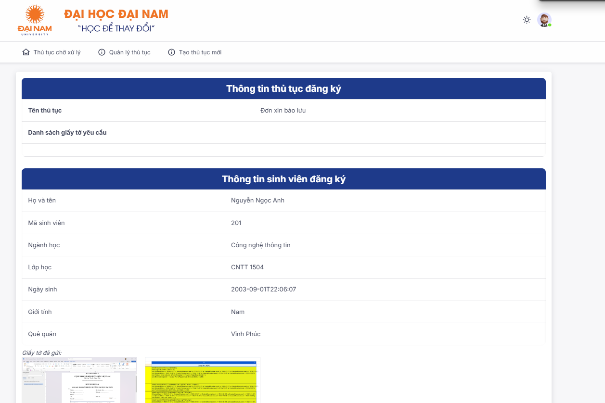
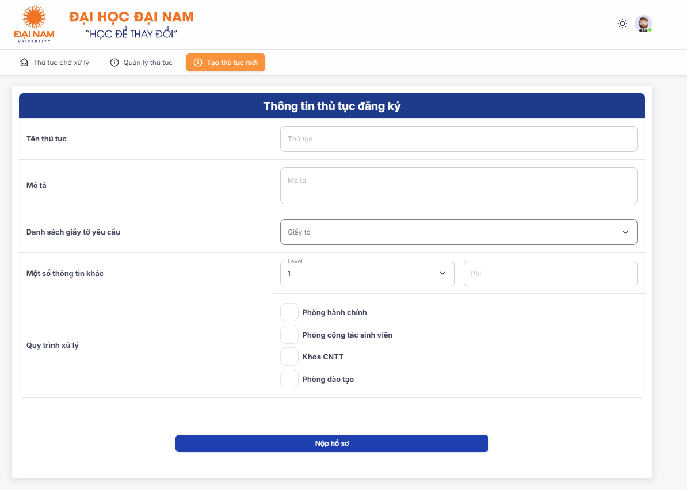
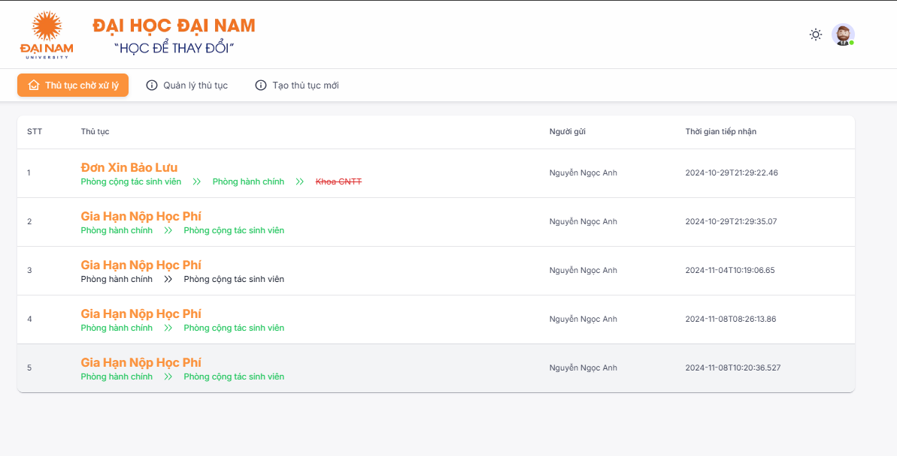
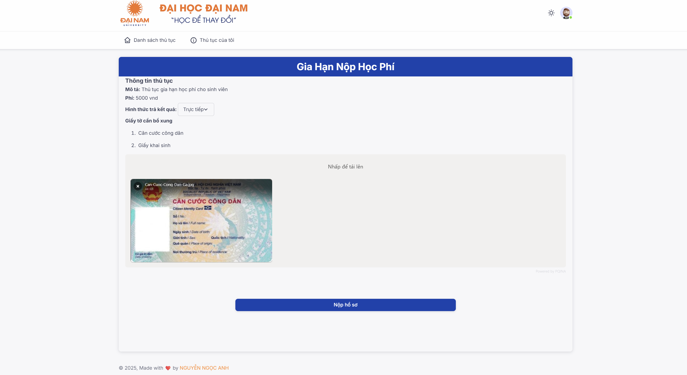

# Ứng dụng Web giải quyết thủ tục hành chính cho trường học

## Giới thiệu
Ứng dụng web hỗ trợ xử lý các thủ tục hành chính trong trường học, giúp sinh viên và cán bộ quản lý, duyệt hồ sơ một cách hiệu quả.

## Chức năng
### Dành cho sinh viên:
- Xem danh sách thủ tục có thể giải quyết trực tuyến.
- Xem chi tiết yêu cầu của từng thủ tục.
- Nộp đơn xin giải quyết (hỗ trợ đính kèm tệp).

### Dành cho cán bộ, giảng viên:
- Kiểm tra các thủ tục hành chính thuộc phạm vi quản lý.
- Duyệt hoặc từ chối các thủ tục.
- Theo dõi trình tự xử lý của từng thủ tục.
- Tạo thủ tục mới khi cần thiết.

## Công nghệ
- **Backend**: C#, .NET 8, Xác thực JWT.
- **Frontend**: ReactJS, Next.js, Material UI, Tailwind CSS.
- **Cơ sở dữ liệu**: SQL Server.

## Hình ảnh minh hoạ
- Giao diện xử lý thủ tục

- Giao diện tạo thủ tục

- Thủ tục chờ xử lý

- Giao diện gửi thủ tục
